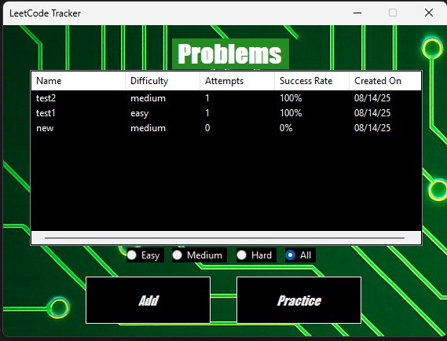
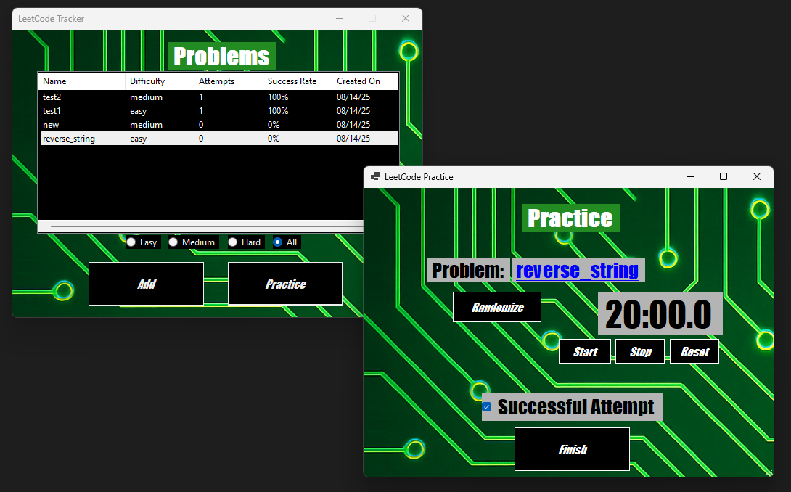
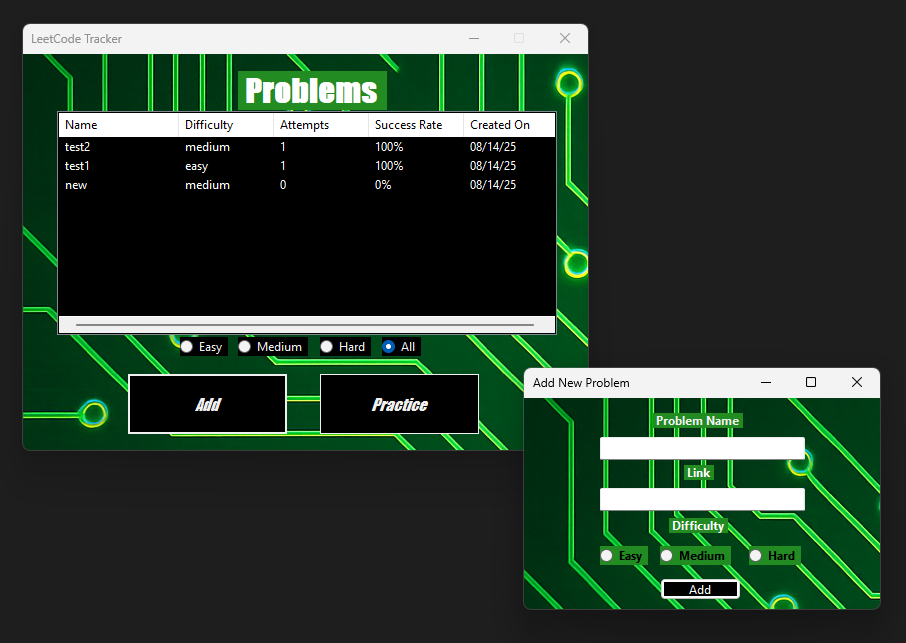
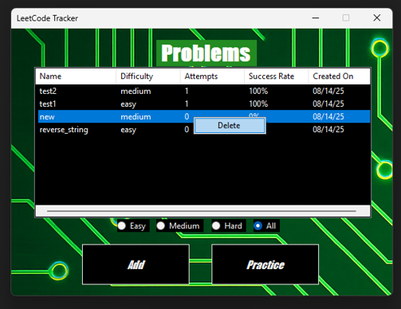

# LeetCode Tracker

A C# WinForms application for tracking and practicing LeetCode-style data structures & algorithms problems.



## Overview
LeetCode Tracker helps you add problems, track attempts and success rate, sort by multiple attributes, and practice either randomly or by selecting a specific problem from the list.

## Features
- **Add problems** with name, description, difficulty, and creation date.
- **Practice a specific problem**: click a row in the ListView, then click **Practice** to open that exact problem.
- **Random practice** option for quick sessions.
- **Right-click delete**: remove an item via context menu.
- **Sorting by column**: Name, Difficulty, Attempts, Success Rate, Date Created (click the column header).
- **Clickable links**: open the problem in your browser from the practice window.
- **Timer**: 20-minute countdown for timed practice.

## Screenshots
-  
- 
- 

## Installation
1. **Clone**
   ```bash
   git clone https://github.com/robidouxrd/LeetCodeTracker.git
   cd LeetCodeTracker
